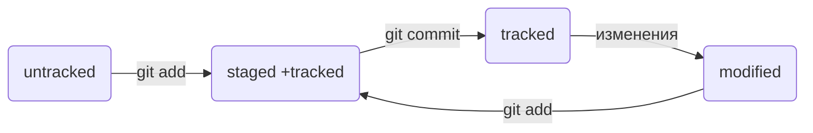

# Шпаргалка команд
Это обычная шпаргалка, где написаны базовые команды для консоли.
---


## Навигация 
- *pwd* узнать свое место нахождение;<br> 
- *ls* показать список файлов и папок данной папки;<br>
- *ls -a*  показать скрытые файлы которые начинаються с '.';<br>
- *cd* перейти в другую папку;<br>
- *cd ..* перейти в родительскую папку;<br>
- *cd ~* домашняя директория;<br>
- *cd /* корневая директория;<br>
---


## Работа с папками и файлами
### Создание файлов и папок
- *touch* создание файла;<br>
- *mkdir* создание папки;<br>
### Копирование и перемещение
- *cp* копирование;<br>
- *mv* перемещение;<br>
### Чтение
- *cat* распечать содержимое текстового файла;<br>
### Удаление
- *rm* удаление файла;<br>
- *rmdir* удалиение папки;<br>
- *rm -r* удаление папки и всего содержимого вней;<br>
---


## Полезные возможности


- Если вам надо сделать несколько папок или файлов одновременно то используйте _&&_;<br>
- Если вы хотите повторить предыдущую команду то използуйте стрелки _вверх_ и _вниp_, чтобы листать историю буфера;<br>
- Чтобы не вводить название файла или папки полностью, можно набрать первые символы имени и дважды нажать _Tab_.<br>
---


## Создание прокекта в локальном и синхронизация его в GitHub
- *git status* статус файлов в папке в которой вы находитесь;<br>
- *git init* используется для инициализации нового репозитория Git в указанном каталоге;<br>
- *git add* добавление файла или обновление если вы его изменилит;<br>
- *git commit -m "Текст"* сохрание изменений в этой папке с сообщение(оно обезательно);<br>
- *git push "название" master/main* создание репозитория;<br>

---


## Генерация SSH-ключа
- *ssh-keygen -t ed25519 -C "электронная почта, к которой привязан ваш аккаунт на GitHub"* генерация ключа
- *clip < ~/.ssh/id_ed25519.pub* копирование в буферный обмен
---


# Как сделать  README
Для начала создаем благодаря команде *touch* файл *README.md*, после заходим в любой редактор по типу блакнота и используем команды *Markdown* такие как:


"#" H1 — заголовок первого уровня, самый большой<br>
"##" H2 — заголовок второго уровня, поменьше<br>
"###" H3 <br>
"####" H4 <br>
"#####" H5 <br>
"######" H6 — заголовок шестого уровня, самый маленький <br>


"---" напишите, чтобы сделать такую линию как внизу
---
 


Курсив — это *звёздочки* или _подчёркивания_. 
Полужирный шрифт — двойные **звёздочки** или двойные(__подчёркивания__.
Можно совместить выделение **звёздочки и _подчёркивания_**


Нумерация с числами
1. Первый пункт нумерованного списка.
2. Второй пункт. 


Нумерация без чисел это * или -
* первый пункт ненумерованного списка;
* второй пункт ненумерованного списка

- первый пункт ненумерованного списка;
- второй пункт ненумерованного списка 


## Как делать ссылки
[Обычная ссылка в строке](https://www.google.com)

## Как делать код
Чтобы оформить текст как код, нужно окружить его тройками косых кавычек "```"
```bash
ls - la
```
```html
<h1>А я просто текст</h1>
``` 


---
## Хэш - индефикатор коммита


Хеширование (от англ. hash, «рубить», «крошить», «мешанина») — это способ преобразовать набор данных и получить их «отпечаток» (англ. fingerprint).
Информация о коммите — это набор данных: когда был сделан коммит, содержимое файлов в репозитории на момент коммита и ссылка на предыдущий, или родительский (англ. parent), коммит.


Пример хеша
```
commit e83c5163316f89bfbde7d9ab23ca2e25604af290 < ------ это хэш в коммите
Author: Linus Torvalds <torvalds@linux-foundation.org>
Date:   Thu Apr 7 15:13:13 2005 -0700
```   


---
## Лог


Лог это журнал в котором показана история коммитов.<br>
- *git log* появляеться подробный список коммитов<br>
- *git log --oneline* появляеться краткий список коммитов, удобно если у вас много коммитов


---
## HEAD


Файл HEAD (англ. «голова», «головной») — один из служебных файлов папки .git. Он указывает на коммит, который сделан последним (то есть на самый новый).<br>
```
$ cat refs/heads/master # взяли ссылку из файла HEAD
# внутри хеш
e007f5035f113f9abca78fe2149c593959da5eb7

$ git log 
# сверяем с хешем последнего коммита
commit e007f5035f113f9abca78fe2149c593959da5eb7
Author: John Doe <johndoe@example.com>
Date:   Tue Mar 28 00:26:53 2023 +0300

    Добавить амбиций в список дел

... # другие коммиты
```
Когда вы делаете коммит, Git обновляет refs/heads/master — записывает в него хеш последнего коммита. Получается, что HEAD тоже обновляется, так как ссылается на refs/heads/master.


---
## Статусы файлов в Git

- *untracked* неотслеживаемый - то есть у него нет за фиксированных коммитов или через команду *git add* <br>
- *staged* подготовленный - после комманды *git add*<br>
- *tracked* отслеживаемый - зафиксированы с помощью *git commit* и файлы которые были добавлены командой *git add*<br>
- *modified* изменёнынный - значит этот фаил изменили<br>





---
## Оформление сообщений к коммитам


Это очень важно если вы в команде. Используються несколько ситилей оформления такие как <br>
- Корпоративные<br>
```
$ git commit -m "LGS-239: Дополнить список пасхалок новыми числами"
```
- Conventional Commits -Conventional Commits предлагает такой формат коммита: <type>: <сообщение>. Первая часть type — это тип изменений. Таких типов достаточно много. Вот два примера:<br>
feat (сокращение от англ. feature) — для новой функциональности;<br>
fix (от англ. «исправить», «устранить») — для исправленных ошибок.<br>
```
$ git commit -m "feat: добавить подсчёт суммы заказов за неделю"
```
- GitHub-стиль: коммиты должны быть по возможности на английском языке, а также напрямую писать изменения: так будет проще понимать, что изменено в коммите.
```
$ git commit -m "fix #334, added temperature graph"
$ git commit -m "change temperature graph logic"
```
